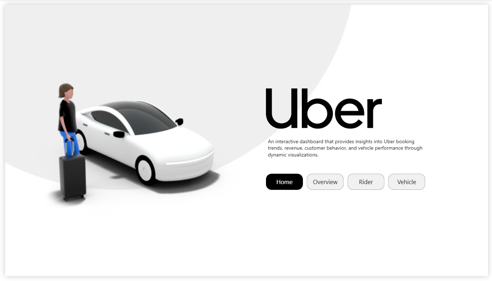
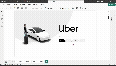

# 🚖 Uber Ride Analysis Dashboard

<p align="center">

</p>

## 📌 Overview

This project presents an interactive Power BI dashboard built to analyze Uber ride operations. It transforms raw ride data into meaningful business insights through interactive visualizations, KPIs, dynamic filtering, and user-friendly navigation.

The dashboard helps stakeholders monitor operational performance, booking trends, ride cancellations, customer satisfaction, and revenue across different vehicle types.

---

## 🎯 Business Objectives

* Analyze overall booking performance.
* Monitor completed and cancelled rides.
* Compare vehicle type performance.
* Track booking revenue.
* Evaluate customer ratings.
* Identify cancellation patterns.

---

## 📊 Dashboard Features

* Interactive KPI Cards
* Dynamic Vehicle Selection
* Bookmarks & Pop-up Panels
* Customer Rating Visualization
* Revenue Analysis
* Ride Distance Analysis
* Cancellation Insights
* Interactive Filters

---

## 📈 Key Performance Indicators (KPIs)

* Total Bookings
* Total Booking Value
* Average Ride Distance
* Average Customer Rating
* Completed Rides
* Cancelled Rides

---

## 🛠️ Tools Used

* Power BI
* Power Query
* DAX
* Data Modeling

---

## 📷 Dashboard Preview

### Dashboard


---

## 🎥 Dashboard Demo



---

## 📂 Dataset

The dashboard was created using an Uber rides dataset for educational and portfolio purposes.

---

## 📁 Project Structure

```
Uber-Ride-Analysis-Dashboard
│
├── Images
│   ├── dashboard.png
│   ├── dashboard2.png
│   ├── dashboard3.png
│   ├── dashboard4.png
│   └── demo.gif
│
├── Dataset
│   └── Uber.xslx
│
└── README.md
```

---

## 🚀 Future Improvements

* Mobile dashboard layout
* Additional drill-through pages
* Forecasting visuals
* Time intelligence metrics

---

## 👩‍💻 Author

**Sara Farouk**

Aspiring Data Analyst

LinkedIn:
https://www.linkedin.com/in/sara-farouk1/

GitHub:
https://github.com/Siri1724
